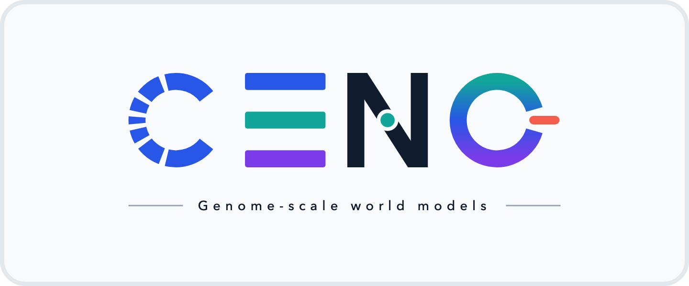

<div align="center">

<picture>
  <source media="(prefers-color-scheme: dark)" srcset="assets/brand/ceno-banner-dark.png">
  <source media="(prefers-color-scheme: light)" srcset="assets/brand/ceno-banner-light.png">
  
</picture>

# CENO

**One model that reads, scores, and writes DNA at genome scale.**

*A genome-scale world model built on a Mamba / Attention / MoE hybrid backbone,
trained with multi-species alignment (MSA) post-training.*

[](LICENSE)
[](https://huggingface.co/collections/CladeTeam/ceno)
[](https://cladeteam.github.io/ceno.github.io/)
[](requirements.txt)

[**Project page**](https://cladeteam.github.io/ceno.github.io/) ·
[**Hugging Face models**](https://huggingface.co/collections/CladeTeam/ceno) ·
[**Quickstart**](#-quickstart) ·
[**Checkpoints**](#-checkpoints) ·
[**Citation**](#-citation)

</div>

---

## Overview

**CENO** uses one long-context autoregressive model to **understand** long DNA,
**score** the effect of mutations, and **design** new regulatory sequences —
instead of building a separate tool for each task. This repository contains the
open-source **code** for three tasks:

| Part | Directory | What it does |
|------|-----------|--------------|
| 1. Model code | [`ceno_model/`](ceno_model) | HuggingFace `trust_remote_code` package for **CENO-P** (the MSA post-trained model). Loads via `from_pretrained`, supports both generation and MSA-based variant scoring. |
| 2. Variant Effect Prediction (VEP) | [`vep/`](vep) | HuggingFace-only VEP pipeline with a **TraitGym** worked example: load CENO-P → score WT vs. variant sequences (delta log-likelihood) → AUROC / AUPRC. |
| 3. Generation demo | [`generation/`](generation) | vLLM offline inference demo (generation + embedding) for the pre-trained DNA model, including the patcher that wires this repo's model code into a checkpoint dir. |

> [!NOTE]
> **This repo ships code only.** Model weights live on the HuggingFace Hub — see
> [Checkpoints](#-checkpoints) below. The code is checkpoint-agnostic: point the VEP and
> generation entry points at a checkpoint — either a Hub id or a local directory.

## At a glance

| | |
|---|---|
| **Context** | 8k → **1M tokens** (up to 1,048,576) long-context continuation |
| **Sizes** | 80M / 300M / 600M / 1B parameters, one staged curriculum |
| **One interface** | a single likelihood powers completion, perturbation, conditioning, and design |
| **Efficiency** | ~8× faster long-context generation than Evo 2, with no out-of-memory failures |

## 🚀 Quickstart

```bash
pip install -r requirements.txt

# Part 1 — smoke test the model code (no weights needed):
python -m ceno_model.examples.load_model

# Part 2 — VEP self-test (synthetic MSA + mock scorer, no GPU / weights / data needed):
python -m vep.run_traitgym --self-test

# Part 3 — real generation needs a GPU, the pinned vLLM environment, and a
# patched base CENO checkpoint (see generation/README.md).
```

For the real TraitGym VEP run you additionally need: a CENO-P checkpoint, the human MSA zarr, and
the GRCh38 reference FASTA. See [`vep/README.md`](vep/README.md) for where each comes from.

## Architecture in one paragraph

CENO packs a 2-D multiple-sequence alignment `(L, D)` (length × depth) into a single 1-D token
sequence by **concatenating the MSA rows** `[row₁, row₂, …, row_K, target]` with no special
tokens, and passes a per-token `seq_idx` so the model knows the row boundaries. A per-layer
`intra_encoding_pattern` (`+` = isolate rows by resetting Mamba SSM state and masking
cross-segment attention; `-` = let rows fuse) alternates isolation and fusion across the layer
stack. The reference (human) sequence is the final `target` segment, so the model scores it
after recurrently consuming the whole alignment. When `seq_idx` is omitted, the model degrades
to ordinary causal-LM behavior — which is why the same package serves both generation and MSA
scoring. See [`ceno_model/README.md`](ceno_model/README.md) for the `from_pretrained` details.

## 📦 Checkpoints

Model weights are published on the HuggingFace Hub under the [`CladeTeam`](https://huggingface.co/CladeTeam)
organization — see the [CENO collection](https://huggingface.co/collections/CladeTeam/ceno).
There are **15 checkpoints** in two families:

- **CENO** — base DNA foundation model (bfloat16), for **generation** / single-sequence scoring.
  Four sizes (80M / 300M / 600M / 1B) × three training-context stages (`base` / `131k` / `1m`)
  = 12 checkpoints, e.g. [`CladeTeam/CENO-1B-base`](https://huggingface.co/CladeTeam/CENO-1B-base).
- **CENO-P** — MSA post-trained (float32), for **variant-effect scoring** (see [`vep/`](vep)).
  Three sizes (300M / 600M / 1B), e.g. [`CladeTeam/CENO-P-600M`](https://huggingface.co/CladeTeam/CENO-P-600M).

Every checkpoint bundles this repo's model code, so it loads standalone with
`trust_remote_code=True` — nothing else to set up.

### Hardware

CENO runs on any recent CUDA GPU — validated on **NVIDIA A100 and H100**, and works on other
Ampere-or-newer cards. Multi-GPU is supported via `device_map="auto"`. CPU works for small
smoke tests but is much slower.

### Inference with HuggingFace (bfloat16)

```python
import torch
from transformers import AutoModelForCausalLM, AutoTokenizer

model_id = "CladeTeam/CENO-1B-base"            # any *base* CENO checkpoint
tok = AutoTokenizer.from_pretrained(model_id, trust_remote_code=True)
model = AutoModelForCausalLM.from_pretrained(
    model_id,
    trust_remote_code=True,
    torch_dtype=torch.bfloat16,                # bf16 on A100 / H100
    device_map="auto",
).eval()

input_ids = tok.encode("ATCG", return_tensors="pt").to(model.device)
out = model.generate(
    input_ids, max_new_tokens=128, do_sample=True, temperature=0.8, top_p=0.95
)
print(tok.decode(out[0], skip_special_tokens=True))
```

> [!TIP]
> Use a **base** checkpoint for `model.generate()`. **CENO-P** is an MSA variant-effect
> scorer — drive it through [`vep/`](vep), not `generate()`.

<details>
<summary>Loading a local checkpoint dir · <code>auto_map</code> details</summary>

Instead of a Hub id you can pass a local directory to `from_pretrained` (or `--model_dir`).
Each checkpoint's `config.json` carries the `auto_map` that points `trust_remote_code` at this
package's modules:

```json
{
  "auto_map": {
    "AutoConfig": "configuration_ceno.CENOConfig",
    "AutoModelForCausalLM": "modeling_ceno.CENOForCausalLM",
    "AutoTokenizer": ["ceno_tokenizer.CENOCharLevelTokenizer", null]
  }
}
```

`generation/patch_vllm_for_dna.py` copies this repo's model code into a checkpoint dir so
`trust_remote_code=True` resolves it.

</details>

## 📝 Citation

If you use CENO in your research, please cite the technical report:

```bibtex
@misc{ceno2026,
  title  = {CENO: A Genome-Scale World Model for
            Evolutionary Sequence Interpretation and
            Programmable Regulatory Design},
  author = {Ma, Mingqian and Wu, Yucheng and Chen, Xin and Jiang, Feifei and
            Lin, Peijun and Ye, Dongxin and Sun, Yidi and Zhang, Yijing and
            Shi, Tianqiong and Zhao, Yu and Ouyang, Wanli and Zhou, Bowen and
            Bai, Lei and Ren, Yuchen},
  year   = {2026},
  note   = {Technical report}
}
```

When using the bundled VEP sample, please also cite the upstream
[TraitGym](https://github.com/songlab-cal/TraitGym) benchmark (MIT License).

For correspondence: `renyuchen@pjlab.org.cn` (Shanghai Artificial Intelligence Laboratory).

## License

Apache-2.0. The model code derives from NVIDIA's Nemotron-H HuggingFace implementation
and the tokenizer derives from Arc Institute's Evo2 CharLevelTokenizer (both Apache-2.0).
See [`LICENSE`](LICENSE) and [`NOTICE`](NOTICE).
